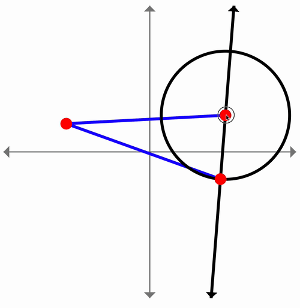

# React Dynamic Geometry

A dynamic geometry library built on top of [React.js](https://reactjs.org/) and [Jotai](https://github.com/pmndrs/jotai). Easily create geometry "boards" with dynamic elements.

## Sample

The following code:

```jsx
<GeometryBoard>
  {(builder) => {
  	builder.axes();
  	const A = builder.point(-3, 3);
  	const B = builder.point(4, 4);
  	const O = builder.point(0, 0);

  	builder.line(A, B);
  	builder.lineSegment(O, A);
  	builder.lineSegment(O, B);
  	builder.circle(A, B);
  }}
</GeometryBoard>
```

Generates the following dynamic geometry board.



## WARNING

This project is still in the phase of "just playing around". I'm having fun building out geometric constructs, but do have plans to make this a more serious project once a few more ideas are fleshed out.

## Feedback Welcome

Does this thing interest you? Hit me up! I want to hear your ideas.

