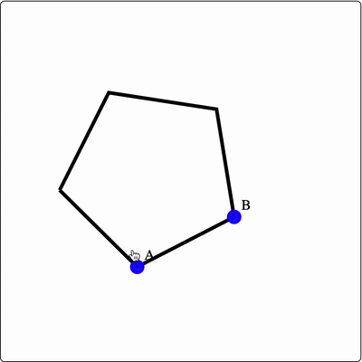
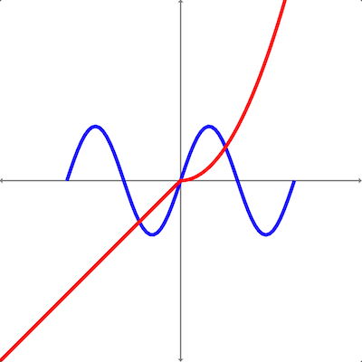
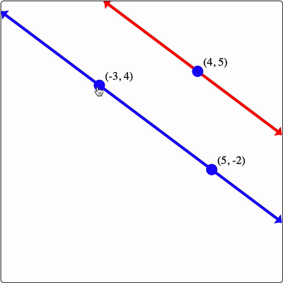
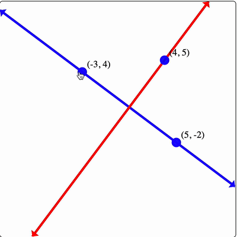
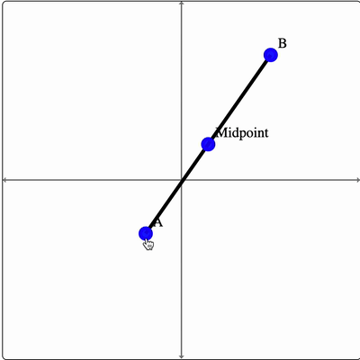
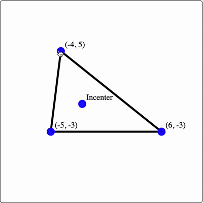
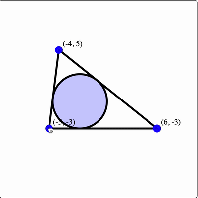
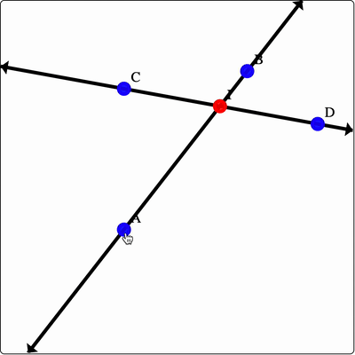
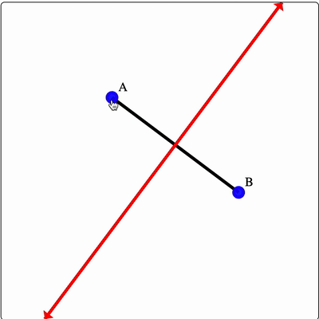

# React Dynamic Geometry

A dynamic geometry library built on top of [React.js](https://reactjs.org/), [Jotai](https://github.com/pmndrs/jotai),
and rendered with SVG. Easily create geometry "boards" with dynamic elements. Jotai is used for fine-grained state
updates to keep dynamic boards performant.

Here's a cute sample. The following code:

```jsx
<GeometryBoard>
  {(build) => {
    build("Axes", {});

    const A = build("Point", { x: 2, y: 2, cfg: { label: "A" } });
    const B = build("Point", { x: -3, y: 3 });
    const O = build("Point", { x: -5, y: 8 });

    build("Line", { start: A, end: B });
    build("Circle", { center: B, radius: A.x });
    build("Polygon", {
      vertices: [A, B, O],
      cfg: { fill: "red", fillOpacity: 0.5 },
    });
  }}
</GeometryBoard>
```

Generates the following dynamic geometry board.


## Setup

If you're working inside a React project, all you need to do is install this library.

```shell
# For NPM
npm install react-dynamic-geometry

# For Yarn
yarn add react-dynamic-geometry
```

Once the library is installed, import the `GeometryBoard` component from this library, and go to town!

```jsx
import { GeometryBoard } from 'react-dynamic-geometry';

const MyFirstBoard = () => (
  <GeometryBoard>
    {(build) => {
      build("Point", { x: 3, y: 5, cfg: { label: "Hello world!" } });
    }}
  </GeometryBoard>
)
```

## API

This library exports a single component, `GeometryBoard`, that takes a "builder" function as its sole child. The library
exposes a handful of helpers for you to build dynamic geometry boards (via this builder function).

Here's a small example to give you a taste of how to use the library:

```jsx
<GeometryBoard>
  {(build) => {
    const A = build("Point", { x: 0, y: 0 });
    const B = build("Point", { x: 3, y: 5 });
    build("Line", { start: A, end: B });
  }}
</GeometryBoard>
```

The builder function is strongly-typed, so your editor should give you some intellisense about what types of elements
you can construct, and what their options are. The following documentation attempts to do this explicitly.

### Axes

The `Axes` element will create a set of axes on the board. We're still working on adding options for this element, so
for now, this is as spicy as it gets:

```jsx
<GeometryBoard>
  {(build) => {
    build("Axes", {});
  }}
</GeometryBoard>
```

### Point

The `Point` element will create a point on the board. Here's a quick example:

```jsx
<GeometryBoard>
  {(build) => {
    build("Axes", {});

    const A = build("Point", { x: 3, y: 4 });
    build("Point", {
      x: -4,
      y: A.y,
      cfg: { label: "B", color: "red" },
    });
  }}
</GeometryBoard>
```

which produces the following:


#### Options

The build signature for creating a `Point` element is `build("Point", options: { x, y, cfg? }): Point` with options
listed below.

| Option | Type | Required? | Description |
| --- | --- | --- | --- |
| `x` | `number` or `NumberAtom` | ✅ | x coordinate of the point. If provided a `number`, value is a "free" atom which can be updated via drag. If provided a `NumberAtom`, coordinate cannot be change via drag. |
| `y` | `number` or `NumberAtom` | ✅ | y coordinate of the point. Same behavior as `x`, but with the `y` coordinate |
| `cfg.size` | `number` | ❌ | Size of the point in SVG units. Defaults to `1.5`.|
| `cfg.color` | `string` | ❌ | Color of the point. |
| `cfg.label` | `string` | ❌ | Label to add to the point. |
| `cfg.hideLabel` | `boolean` | ❌ | Set to `true` to hide the label completely. |
| `cfg.hidden` | `boolean` | ❌ | Set to `true` to hide the point completely. |

### Line

The `Line` element will create a line on the board, passing through two provided points (`start` and `end`). Here's an
example:

```jsx
<GeometryBoard>
  {(build) => {
    const A = build("Point", { x: -5, y: 5 });
    const B = build("Point", { x: 3, y: -4 });
    const C = build("Point", { x: -3, y: -5 });

    build("Line", { start: A, end: B, cfg: { stroke: "purple" } });
    build("Line", { start: A, end: C, cfg: { isSegment: true } });
  }}
</GeometryBoard>
```

which produces the following:


#### Options

The build signature for creating a `Line` element is `build("Line", options: { start, end, cfg? }): Line` with options
listed below.

| Option | Type | Required? | Description |
| --- | --- | --- | --- |
| `start` | `Point` | ✅ | "Starting" point for the line (it passes through this point). |
| `end` | `Point` | ✅ | "Ending" point for the line (it passes through this point). |
| `cfg` | `Partial<React.SVGProps<SVGLineElement>> & { isSegment?: boolean; }` | ❌ | SVG properties for the `line` primitive element used to draw the Line. |
| `cfg?.isSegment` | `boolean` | ❌ | Pass `true` to render as a line segment. |

### Circle

The `Circle` element will create a circle on the board, centered at a provided point and with a specified radius. If a
number is provided as the radius, that will be used as the radius. If a point is provided as the radius, the circle will
pass through that point. Here's an example:

```jsx
<GeometryBoard>
  {(build) => {
    const A = build("Point", { x: 1, y: 1 });
    build("Circle", {
      center: A,
      radius: 3,
      cfg: { fill: "blue", fillOpacity: 0.2 },
    });

    const B = build("Point", { x: 4, y: 5 });
    build("Circle", {
      center: B,
      radius: A,
      cfg: { stroke: "purple" },
    });
  }}
</GeometryBoard>
```

which produces the following:


#### Options

The build signature for creating a `Circle` element is `build("Circle", options: { center, radius, cfg? }): Circle` with
options listed below.

| Option | Type | Required? | Description |
| --- | --- | --- | --- |
| `center` | `Point` | ✅ | Center point of the circle. |
| `radius` | `Point` or `number` or `NumberAtom` | ✅ | If number-like, provides the radius of the circle. If `Point`, circle will pass through this point. |
| `cfg` | `Partial<React.SVGProps<SVGEllipseElement>>` | ❌ | SVG properties for the `ellipse` primitive element used to draw the Circle. |

### Polygon

The `Polygon` element will create a polygon on the board with the provided vertices. The order of the vertices does _
not_ matter, the library will try to create a polygon with non-intersecting sides. Here's an example:

```jsx
<GeometryBoard>
  {(build) => {
    const getRandomCoord = () => -9 + Math.round(18 * Math.random());
    const vertices = [1, 2, 3, 4, 5].map(() =>
      build("Point", { x: getRandomCoord(), y: getRandomCoord() }),
    );

    build("Polygon", {
      vertices,
      cfg: { fill: "green", fillOpacity: 0.2 },
    });
  }}
</GeometryBoard>

```

which produces the following:


#### Options

The build signature for creating a `Polygon` element is `build("Polygon", options: { vertices, cfg? }): Polygon` with
options listed below.

| Option | Type | Required? | Description |
| --- | --- | --- | --- |
| `vertices` | `Point[]` | ✅ | Array of `Point` elements that define the vertices of the polygon. |
| `cfg` | `Partial<React.SVGProps<SVGPathElement>>` | ❌ | SVG properties for the `path` primitive element used to draw the Polygon. |

### RegularPolygon

The `RegularPolygon` element will create a regular polygon on the board with a provided number of sides, and having vertices containing the two provided points. Here's an example:

```jsx
<GeometryBoard>
  {(build) => {
    const A = build("Point", { x: -2, y: -5, cfg: { label: "A" } });
    const B = build("Point", { x: 3, y: -2, cfg: { label: "B" } });
    
    build("RegularPolygon", { points: [A, B], numSides: 5 });
  }}
</GeometryBoard>
```

which produces the following:



#### Options

The build signature for creating a `RegularPolygon` element is `build("RegularPolygon", options: { points, cfg? }): Polygon` with
options listed below.

| Option | Type | Required? | Description |
| --- | --- | --- | --- |
| `Points` | `[Point, Point]` | ✅ | Two of the vertices the Regular Polygon should have. |
| `cfg` | Same as Polygon's configuration options | ❌ | SVG properties for the `path` primitive element used to draw the Regular Polygon. |

### FunctionGraph

The `FunctionGraph` element will create a graph of a function. You must provide the function definition to plot, an
optionally provide the start (`a`) and end (`b`) x-values for the plot. Here's an example:

```jsx
<GeometryBoard>
  {(build) => {
    build("Axes", {});

    build("FunctionGraph", {
      fn: (x) => 3 * Math.sin(x),
      a: -2 * Math.PI,
      b: 2 * Math.PI,
      cfg: { stroke: "blue" },
    });

    build("FunctionGraph", {
      fn: (x) => (x <= 0 ? x : 0.3 * x * x),
      cfg: { stroke: "red" },
    });
  }}
</GeometryBoard>
```

which produces the following:



#### Options

The build signature for creating a `FunctionGraph` element
is `build("FunctionGraph", options: { fn, a?, b? cfg? }): FunctionGraph` with options listed below.

| Option | Type | Required? | Description |
| --- | --- | --- | --- |
| `fn` | `(x: number) => number` | ✅ | Function definition for the plot. |
| `a` | `number` or `NumberAtom` | ❌ | Starting x-value for the plot. |
| `b` | `number` or `NumberAtom` | ❌ | Ending x-value for the plot. |
| `cfg` | `Partial<React.SVGProps<SVGPathElement>>` | ❌ | SVG properties for the `path` primitive element used to draw the FunctionGraph. |

### ParallelLine

The `ParallelLine` element will create a line that is parallel to another line that you provide, passing through a point
that you provide. Here's an example:

```jsx
<GeometryBoard>
  {(build) => {
    const A = build("Point", { x: -3, y: 4 });
    const B = build("Point", { x: 5, y: -2 });
    const C = build("Point", { x: 4, y: 5 });
    const L = build("Line", { start: A, end: B, cfg: { stroke: "blue" } });

    build("ParallelLine", {
      parallelTo: L,
      passesThrough: C,
      cfg: { stroke: "red" },
    });
  }}
</GeometryBoard>
```

which produces the following:



#### Options

The build signature for creating a `ParallelLine` element
is `build("ParallelLine", options: { parallelTo, passesThrough, cfg? }): Line` with options listed below.

| Option | Type | Required? | Description |
| --- | --- | --- | --- |
| `parallelTo` | `Line` | ✅ | Line that this line will be parallel to. |
| `passesThrough` | `Point` | ✅ | Point that the parallel line will pass through. |
| `cfg` | `Partial<React.SVGProps<SVGLineElement>>` | ❌ | SVG properties for the `line` primitive element used to draw the ParallelLine. |

### PerpendicularLine

The `PerpendicularLine` element will create a line that is perpendicular to another line that you provide, passing
through a point that you provide. Here's an example:

```jsx
<GeometryBoard>
  {(build) => {
    const A = build("Point", { x: -3, y: 4 });
    const B = build("Point", { x: 5, y: -2 });
    const C = build("Point", { x: 4, y: 5 });
    const L = build("Line", { start: A, end: B, cfg: { stroke: "blue" } });

    build("PerpendicularLine", {
      perpendicularTo: L,
      passesThrough: C,
      cfg: { stroke: "red" },
    });
  }}
</GeometryBoard>
```

which produces the following:



#### Options

The build signature for creating a `PerpendicularLine` element
is `build("PerpendicularLine", options: { perpendicularTo, passesThrough, cfg? }): Line` with options listed below.

| Option | Type | Required? | Description |
| --- | --- | --- | --- |
| `perpendicularTo` | `Line` | ✅ | Line that this line will be perpendicular to. |
| `passesThrough` | `Point` | ✅ | Point that the perpendicular line will pass through. |
| `cfg` | `Partial<React.SVGProps<SVGLineElement>>` | ❌ | SVG properties for the `line` primitive element used to draw the PerpendicularLine. |

### Midpoint

The `Midpoint` element will create a midpoint between two provided points. Here's an example:

```jsx
<GeometryBoard>
  {(build) => {
    build("Axes", {});
    const A = build("Point", { x: -2, y: -3, cfg: { label: "A" } });
    const B = build("Point", { x: 5, y: 7, cfg: { label: "B" } });

    build("Line", { start: A, end: B, cfg: { isSegment: true } });
    build("Midpoint", { start: A, end: B, cfg: { label: "Midpoint" } });
  }}
</GeometryBoard>
```

which produces the following:



#### Options

The build signature for creating a `Midpoint` element is `build("Midpoint", options: { start, end, cfg? }): Point` with
options listed below.

| Option | Type | Required? | Description |
| --- | --- | --- | --- |
| `start` | `Point` | ✅ | First point. |
| `end` | `Point` | ✅ | Second point. |
| `cfg` | Same as Point element's `cfg` option. | ❌ | Configuration for display of the point. |

### Incenter

The `Incenter` element will create the incenter of the triangle created by the three provided points. Here's an example:

```jsx
<GeometryBoard>
  {(build) => {
    const A = build("Point", { x: -5, y: -3 });
    const B = build("Point", { x: 6, y: -3 });
    const C = build("Point", { x: -4, y: 5 });
    build("Polygon", { vertices: [A, B, C] });

    build("Incenter", { points: [A, B, C], cfg: { label: "Incenter" } });
  }}
</GeometryBoard>
```

which produces the following:



#### Options

The build signature for creating a `Incenter` element is `build("Incenter", options: { points, cfg? }): Point` with
options listed below.

| Option | Type | Required? | Description |
| --- | --- | --- | --- |
| `points` | `[Point, Point, Point]` | ✅ | Three points that define the triangle used to generate the incenter. |
| `cfg` | Same as Point element's `cfg` option. | ❌ | Configuration for display of the point. |

### Incircle

The `Incircle` element will create the incircle of the triangle created by the three provided points. Here's an example:

```jsx
<GeometryBoard>
  {(build) => {
    const A = build("Point", { x: -5, y: -3 });
    const B = build("Point", { x: 6, y: -3 });
    const C = build("Point", { x: -4, y: 5 });
    build("Polygon", { vertices: [A, B, C] });

    build("Incircle", {
      points: [A, B, C],
      cfg: { fill: "blue", fillOpacity: 0.2 },
    });
  }}
</GeometryBoard>
```

which produces the following:



#### Options

The build signature for creating a `Incircle` element is `build("Incircle", options: { points, cfg? }): Circle` with
options listed below.

| Option | Type | Required? | Description |
| --- | --- | --- | --- |
| `points` | `[Point, Point, Point]` | ✅ | Three points that define the triangle used to generate the incenter. |
| `cfg` | Same as Circle element's `cfg` option. | ❌ | Configuration for display of the `ellipse` SVG primitive. |

### LineIntersection

The `LineIntersection` element will create the interesection point of the two provided lines. Here's an example:

```jsx
<GeometryBoard>
  {(build) => {
    const A = build("Point", { x: -3, y: -3, cfg: { label: "A" } });
    const B = build("Point", { x: 4, y: 6, cfg: { label: "B" } });
    const L1 = build("Line", { start: A, end: B });

    const C = build("Point", { x: -3, y: 5, cfg: { label: "C" } });
    const D = build("Point", { x: 8, y: 3, cfg: { label: "D" } });
    const L2 = build("Line", { start: C, end: D });

    build("LineIntersection", {
      line1: L1,
      line2: L2,
      cfg: { label: "I", color: "red" },
    });
  }}
</GeometryBoard>
```

which produces the following:



#### Options

The build signature for creating a `LineIntersection` element is `build("LineIntersection", options: { line1, line2, cfg? }): Line` with
options listed below.

| Option | Type | Required? | Description |
| --- | --- | --- | --- |
| `line1` | `Line` | ✅ | First of the two lines. |
| `line2` | `Line` | ✅ | Second of the two lines. |
| `cfg` | Same as Point element's `cfg` option. | ❌ | Configuration for display of the `circle` SVG primitive. |

### PerpendicularBisector

The `PerpendicularBisector` element will create the perpendicular bisector for the line segment formed between the two
provided points. Here's an example:

```jsx
<GeometryBoard>
  {(build) => {
    const A = build("Point", { x: -3, y: 4, cfg: { label: "A" } });
    const B = build("Point", { x: 5, y: -2, cfg: { label: "B" } });
    build("Line", { start: A, end: B, cfg: { isSegment: true } });

    build("PerpendicularBisector", {
      start: A,
      end: B,
      cfg: { stroke: "red" },
    });
  }}
</GeometryBoard>
```

which produces the following:



#### Options

The build signature for creating a `PerpendicularBisector` element is `build("PerpendicularBisector", options: { start, end, cfg? }): Line` with
options listed below.

| Option | Type | Required? | Description |
| --- | --- | --- | --- |
| `start` | `Point` | ✅ | First of the two points that form the line segment. |
| `end` | `Point` | ✅ | Second of the two points that form the line segment. |
| `cfg` | Same as Line element's `cfg` option. | ❌ | Configuration for display of the `path` SVG primitive. |

## Feedback Welcome

Does this thing interest you? Hit me up! I want to hear your ideas.

## TODO:

- [ ] Testing setup...
- [ ] GitHub actions for publishing to NPM on commits to main?
- [ ] Customizable axes

### Elements to Create

- [ ] Arc?
- [ ] Bisector?
- [ ] Circumcircle and Circumcenter?
- [x] Midpoint
- [x] Center of Polygon (whatever that's called)
- [x] Function graph/curve
- [ ] Parabola
- [x] Perpendicular
- [ ] Reflection across line
- [x] Regular Polygon
- [ ] Sector
- [ ] Glider point to curve or object? That seems hard...
