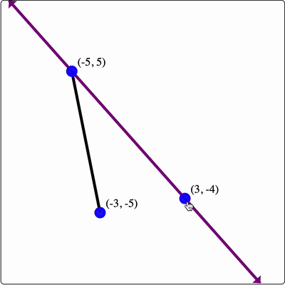

# React Dynamic Geometry

A dynamic geometry library built on top of [React.js](https://reactjs.org/), [Jotai](https://github.com/pmndrs/jotai),
and rendered with SVG. Easily create geometry "boards" with dynamic elements. Jotai is used for fine-grained state
updates to keep dynamic boards performant.

Here's a cute sample. The following code:

```jsx
<GeometryBoard>
  {(build) => {
    build("Axes", {});

    const A = build("Point", { x: 2, y: 2, cfg: { label: "A" } });
    const B = build("Point", { x: -3, y: 3 });
    const O = build("Point", { x: -5, y: 8 });

    build("Line", { start: A, end: B });
    build("Circle", { center: B, radius: A.x });
    build("Polygon", {
      vertices: [A, B, O],
      cfg: { fill: "red", fillOpacity: 0.5 },
    });
  }}
</GeometryBoard>
```

Generates the following dynamic geometry board.


## Setup

If you're working inside a React project, all you need to do is install this library.

```shell
# For NPM
npm install react-dynamic-geometry

# For Yarn
yarn add react-dynamic-geometry
```

Once the library is installed, import the `GeometryBoard` component from this library, and go to town!

```jsx
import { GeometryBoard } from 'react-dynamic-geometry';

const MyFirstBoard = () => (
  <GeometryBoard>
    {(build) => {
      build("Point", { x: 3, y: 5, cfg: { label: "Hello world!" } });
    }}
  </GeometryBoard>
)
```

## API

This library exports a single component, `GeometryBoard`, that takes a "builder" function as its sole child. The library
exposes a handful of helpers for you to build dynamic geometry boards (via this builder function).

Here's a small example to give you a taste of how to use the library:

```jsx
<GeometryBoard>
  {(build) => {
    const A = build("Point", { x: 0, y: 0 });
    const B = build("Point", { x: 3, y: 5 });
    build("Line", { start: A, end: B });
  }}
</GeometryBoard>
```

The builder function is strongly-typed, so your editor should give you some intellisense about what types of elements
you can construct, and what their options are. The following documentation attempts to do this explicitly.

### Axes

The `Axes` element will create a set of axes on the board. We're still working on adding options for this element, so
for now, this is as spicy as it gets:

```jsx
<GeometryBoard>
  {(build) => {
    build("Axes", {});
  }}
</GeometryBoard>
```

### Point

The `Point` element will create a point on the board. Here's a quick example:

```jsx
<GeometryBoard>
  {(build) => {
    build("Axes", {});

    const A = build("Point", { x: 3, y: 4 });
    build("Point", {
      x: -4,
      y: A.y,
      cfg: { label: "B", color: "red" },
    });
  }}
</GeometryBoard>
```

which produces the following:


#### Options

TODO: Point options...

### Line

The `Line` element will create a line on the board, passing through two provided points (`start` and `end`). Here's an
example:

```jsx
<GeometryBoard>
  {(build) => {
    const A = build("Point", { x: -5, y: 5 });
    const B = build("Point", { x: 3, y: -4 });

    build("Line", { start: A, end: B, cfg: { stroke: "purple" } });
  }}
</GeometryBoard>
```

which produces the following:



#### Options

TODO: Line options

### Line Segment

TODO: Line segment docs

### Circle

The `Circle` element will create a circle on the board, centered at a provided point and with a specified radius. If a
number is provided as the radius, that will be used as the radius. If a point is provided as the radius, the circle will
pass through that point. Here's an example:

```jsx
<GeometryBoard>
  {(build) => {
    const A = build("Point", { x: 1, y: 1 });
    build("Circle", {
      center: A,
      radius: 3,
      cfg: { fill: "blue", fillOpacity: 0.2 },
    });

    const B = build("Point", { x: 4, y: 5 });
    build("Circle", {
      center: B,
      radius: A,
      cfg: { stroke: "purple" },
    });
  }}
</GeometryBoard>
```

which produces the following:


#### Options

TODO: Circle options

### Polygon

The `Polygon` element will create a polygon on the board with the provided vertices. The order of the vertices does _
not_ matter, the library will try to create a polygon with non-intersecting sides. Here's an example:

```jsx
<GeometryBoard>
  {(build) => {
    const getRandomCoord = () => -9 + Math.round(18 * Math.random());
    const vertices = [1, 2, 3, 4, 5].map(() =>
      build("Point", { x: getRandomCoord(), y: getRandomCoord() }),
    );

    build("Polygon", {
      vertices,
      cfg: { fill: "green", fillOpacity: 0.2 },
    });
  }}
</GeometryBoard>

```

which produces the following:


#### Options

TODO: Polygon options

### FunctionGraph

The `FunctionGraph` element will create a graph of a function. You must provide the function definition to plot, an
optionally provide the start (`a`) and end (`b`) x-values for the plot. Here's an example:

```jsx
<GeometryBoard>
  {(build) => {
    build("Axes", {});

    build("FunctionGraph", {
      fn: (x) => 3 * Math.sin(x),
      a: -2 * Math.PI,
      b: 2 * Math.PI,
      cfg: { stroke: "blue" },
    });

    build("FunctionGraph", {
      fn: (x) => (x <= 0 ? x : 0.3 * x * x),
      cfg: { stroke: "red" },
    });
  }}
</GeometryBoard>
```

which produces the following:


#### Options

TODO: Functiongraph options

### ParallelLine

The `ParallelLine` element will create a line that is parallel to another line that you provide, passing through a point
that you provide. Here's an example:

```jsx
<GeometryBoard>
  {(build) => {
    const A = build("Point", { x: -3, y: 4 });
    const B = build("Point", { x: 5, y: -2 });
    const C = build("Point", { x: 4, y: 5 });
    const L = build("Line", { start: A, end: B, cfg: { stroke: "blue" } });

    build("ParallelLine", {
      parallelTo: L,
      passesThrough: C,
      cfg: { stroke: "red" },
    });
  }}
</GeometryBoard>
```

which produces the following:


#### Options

TODO: ParallelLine options

### PerpendicularLine

The `PerpendicularLine` element will create a line that is perpendicular to another line that you provide, passing
through a point that you provide. Here's an example:

```jsx
<GeometryBoard>
  {(build) => {
    const A = build("Point", { x: -3, y: 4 });
    const B = build("Point", { x: 5, y: -2 });
    const C = build("Point", { x: 4, y: 5 });
    const L = build("Line", { start: A, end: B, cfg: { stroke: "blue" } });

    build("PerpendicularLine", {
      perpendicularTo: L,
      passesThrough: C,
      cfg: { stroke: "red" },
    });
  }}
</GeometryBoard>
```

which produces the following:


#### Options

TODO: PerpendicularLine options

### Midpoint

The `Midpoint` element will create a midpoint between two provided points. Here's an example:

```jsx
<GeometryBoard>
  {(build) => {
    build("Axes", {});
    const A = build("Point", { x: -2, y: -3, cfg: { label: "A" } });
    const B = build("Point", { x: 5, y: 7, cfg: { label: "B" } });

    build("LineSegment", { start: A, end: B });
    build("Midpoint", { start: A, end: B, cfg: { label: "Midpoint" } });
  }}
</GeometryBoard>
```

which produces the following:


#### Options

TODO: PerpendicularLine options

### Incenter

### Incircle

## Feedback Welcome

Does this thing interest you? Hit me up! I want to hear your ideas.

## TODO:

- [ ] Testing setup...
- [ ] GitHub actions for publishing to NPM on commits to main?
- [ ] Customizable axes

### Elements to Create

- [ ] Arc?
- [ ] Bisector?
- [ ] Circumcircle and Circumcenter?
- [x] Midpoint
- [ ] Center of Polygon (whatever that's called)
- [x] Function graph/curve
- [ ] Parabola
- [x] Perpendicular
- [ ] Reflection across line
- [ ] Regular Polygon
- [ ] Sector
- [ ] Glider point to curve or object? That seems hard...
